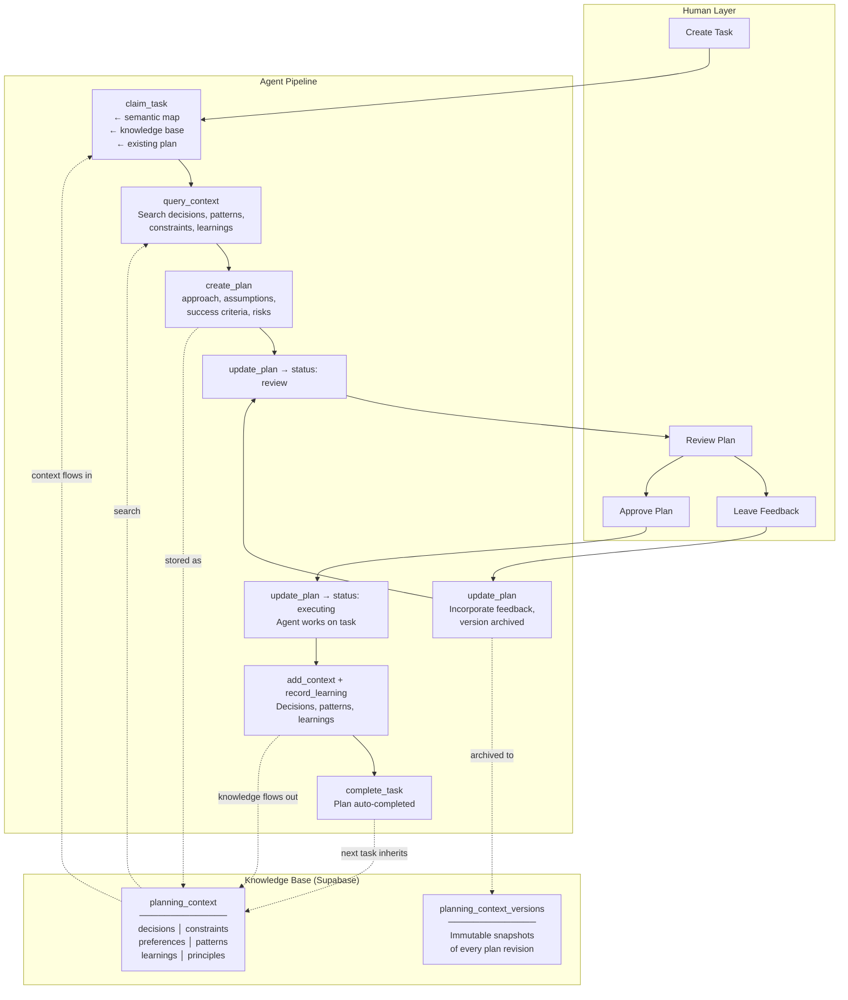

# CrowdListen Planner

> A planning and delegation system for AI agents. Plan before you build, capture knowledge as you go, compound learnings across tasks.

Works with Claude Code, Cursor, Gemini CLI, Codex, Amp, and any MCP-compatible agent.

Part of the [CrowdListen](https://crowdlisten.com) system: **Feed** captures cross-channel audience signal → **Workspace** converts signal into validated decisions → **Planner** (this repo) gives agents a planning harness with cloud-synced context.

## Setup

```bash
npx @crowdlisten/planner login
```

Your browser opens, you sign in to [CrowdListen](https://crowdlisten.com), and it **auto-configures** any coding agents on your machine. Just restart your agent.

No env vars. No JSON to copy. No API keys.

---

## Why This Exists

Most agent tooling gives agents a task list and says "go." That's like handing a contractor a list of rooms to paint without telling them the color, the budget, or that the client hates eggshell finish.

CrowdListen Planner flips this. It's a **planning harness** — not a task board that happens to have plans, but a planning system that happens to have tasks.

**Before**: Task → Execute → Hope it's right
**After**: Task → Plan → Get feedback → Execute with context → Capture what you learned → Next task is smarter

Inspired by [Harness Engineering](https://openai.com/index/harness-engineering/) (constraints as product, phase separation, mechanical gates) and [gruAI](https://github.com/andrew-yangy/gru-ai) (institutional memory, pipeline architecture, progressive disclosure).

---

## Architecture



### Three Layers

```
┌─────────────────────────────────────────────────┐
│  KNOWLEDGE BASE                                 │
│  Decisions, constraints, patterns, principles,  │
│  learnings — persists across all tasks           │
├─────────────────────────────────────────────────┤
│  PLANS                                          │
│  First-class artifacts with lifecycle:           │
│  draft → review → approved → executing → done   │
├─────────────────────────────────────────────────┤
│  TASKS                                          │
│  Executable work units with status tracking     │
└─────────────────────────────────────────────────┘
```

### Design Principles

These principles are drawn from patterns in harness engineering and multi-agent orchestration research:

| Principle | What It Means | How We Apply It |
|-----------|--------------|-----------------|
| **Phase separation** | Research, plan, execute, and review are distinct phases with distinct outputs | Plans must be approved before execution. Feedback reverts to draft. No skipping ahead. |
| **Knowledge compounds** | Every task should leave the system smarter than it found it | `record_learning` captures outcomes. Promoted learnings persist at project level for future tasks. |
| **Constraints as product** | The harness design determines output quality more than model capability | Structured plan fields (approach, assumptions, criteria, risks) force thorough thinking. |
| **Progressive disclosure** | Load context just-in-time, not all at once | `claim_task` returns a semantic map (high-level). `query_context` drills deeper. Agents aren't flooded. |
| **Cloud-synced, not local** | Context shouldn't be trapped in one tool | Knowledge base lives in Supabase with RLS. Start in Claude Code, continue in Cursor — context follows. |
| **Provenance tracking** | Know where knowledge came from | Every entry records source (human/agent), which agent, confidence score. Entries can be superseded or marked stale. |

---

## The Knowledge Base

Every entry has a **type** that tells you what kind of knowledge it is:

| Type | What It Captures | Example |
|------|-----------------|---------|
| `decision` | Choices made and why | "Chose JWT over sessions for stateless API" |
| `constraint` | Hard boundaries | "Must support IE11" / "Budget is $5k/mo" |
| `preference` | Soft preferences | "Use Tailwind" / "Prefer functional style" |
| `pattern` | Conventions discovered | "All API routes follow /api/v1/{resource}" |
| `learning` | Outcomes from work | "Redis caching reduced latency 40%" |
| `principle` | Standing rules | "Never store PII in logs" |

Entries can be scoped to a **project** (visible to all tasks) or to a **specific task**. Learnings can be **promoted** from task scope to project scope so future tasks benefit.

Each entry tracks **provenance** — who wrote it (human or agent), which agent, and a confidence score. Entries can be **superseded** (replaced by newer versions) or marked **stale** when they may no longer apply.

---

## How Plans Work

Plans are first-class artifacts, not comments on a task. They have:

- **Structured fields**: approach, assumptions, constraints, success criteria, risks
- **A lifecycle**: `draft` → `review` → `approved` → `executing` → `completed`
- **Version history**: every content change or feedback archives the previous version
- **Feedback loop**: setting feedback auto-reverts the plan to `draft`

One active plan per task (enforced by unique index). When the task completes, the plan auto-completes too.

```
Agent creates plan (draft)
  → Agent submits for review
    → Human leaves feedback → plan reverts to draft
      → Agent iterates → submits again
        → Human approves
          → Agent executes
            → Task completes → plan completes
```

---

## Workflows

### Full planning workflow

```
1.  create_task("Implement user auth")

2.  claim_task(task_id)
    → Returns: semantic map, knowledge base entries, existing plan, workspace + session

3.  query_context(search="auth")
    → Returns: existing decisions, patterns, learnings about auth

4.  create_plan(task_id, approach="JWT + refresh tokens",
      assumptions=["Server-side validation preferred"],
      success_criteria=["All tests pass", "RLS policies in place"])

5.  update_plan(status="review")
    → Human can now see and review the plan

6.  Human: update_plan(feedback="Also handle 2FA")
    → Plan auto-reverts to draft, feedback stored

7.  Agent: update_plan(approach="JWT + refresh + TOTP 2FA", status="approved")
    → Version 1 archived, plan now v2 approved

8.  update_plan(status="executing") → Agent works

9.  add_context(type="pattern", title="Auth endpoints follow /api/v1/auth/*", ...)
    → Pattern persists for future tasks

10. record_learning(task_id, title="TOTP library X was 3x faster than Y", promote=true)
    → Learning saved to task AND promoted to project level

11. complete_task(task_id, summary="Implemented JWT auth with TOTP 2FA")
    → Task done, plan auto-completed

12. NEXT TASK: claim_task → semantic map now includes auth patterns + TOTP learning
```

### Quick task (no plan needed)

```
claim_task → query_context → execute → record_learning → complete_task
```

Plans are optional. The knowledge base and learning capture still apply.

### Multi-agent collaboration

```
Agent A: create_plan → get approval → update_plan(status=approved)
Agent B: start_session(focus="backend") → query_context → execute
Agent C: start_session(focus="frontend") → query_context → execute
All agents: add_context + record_learning → shared knowledge base
```

### Weight-adaptive (skip what you don't need)

| Task Complexity | Plan? | Knowledge Query? | Learning Capture? |
|----------------|-------|------------------|-------------------|
| Typo fix | No | No | No |
| Bug fix | No | Yes — check for related patterns | Optional |
| Feature | Yes — full plan cycle | Yes — decisions, constraints, patterns | Yes — promote useful findings |
| Architecture change | Yes — with human review | Yes — comprehensive context sweep | Yes — always promote |

---

## Tools Reference

### Task Management

#### `create_task`
Create a new task on your board.

| Parameter | Required | Description |
|-----------|----------|-------------|
| `title` | Yes | Task title |
| `description` | No | Detailed description |
| `board_id` | No | Target board (defaults to global board) |
| `priority` | No | `low`, `medium`, `high`, `critical` |
| `project_id` | No | Associate with a project |

#### `claim_task`
Start working on a task. Moves it to In Progress and returns full context.

| Parameter | Required | Description |
|-----------|----------|-------------|
| `task_id` | Yes | Task to claim |
| `executor` | No | Agent type (auto-detected from env) |
| `branch` | No | Custom git branch name |

**Returns**: `task_id`, `workspace_id`, `session_id`, `branch`, `executor`, `status`, `context_entries[]`, `existing_plan`

#### `complete_task`
Mark task as done. Auto-completes any active plan.

| Parameter | Required | Description |
|-----------|----------|-------------|
| `task_id` | Yes | Task to complete |
| `summary` | No | Completion summary |

#### `get_task`
Full task details including board and column info.

| Parameter | Required | Description |
|-----------|----------|-------------|
| `task_id` | Yes | Task to retrieve |

#### `update_task`
Change title, description, status, or priority.

| Parameter | Required | Description |
|-----------|----------|-------------|
| `task_id` | Yes | Task to update |
| `title` | No | New title |
| `description` | No | New description |
| `status` | No | New status |
| `priority` | No | New priority |

#### `list_tasks`
List tasks, optionally filtered by board.

| Parameter | Required | Description |
|-----------|----------|-------------|
| `board_id` | No | Filter by board (defaults to global) |
| `status` | No | Filter by status |

#### `log_progress`
Log a progress note to the execution session.

| Parameter | Required | Description |
|-----------|----------|-------------|
| `task_id` | Yes | Task to log against |
| `message` | Yes | Progress message |

#### `delete_task`
Remove a task.

| Parameter | Required | Description |
|-----------|----------|-------------|
| `task_id` | Yes | Task to delete |

---

### Planning

#### `create_plan`
Create an execution plan for a task. Status starts as `draft`.

| Parameter | Required | Description |
|-----------|----------|-------------|
| `task_id` | Yes | Task this plan is for |
| `approach` | Yes | The proposed approach |
| `assumptions` | No | List of assumptions |
| `constraints` | No | Known constraints |
| `success_criteria` | No | How to know it's done |
| `risks` | No | Identified risks |
| `estimated_steps` | No | Estimated number of steps |

**Returns**: `{ plan_id, status: "draft", version: 1 }`

#### `get_plan`
Get the active plan for a task with version history.

| Parameter | Required | Description |
|-----------|----------|-------------|
| `task_id` | Yes | Task to get plan for |

**Returns**: `{ plan, versions[] }` or `{ plan: null, message: "No active plan" }`

#### `update_plan`
Iterate on a plan. Content changes archive the current version and increment the version number. Setting feedback auto-reverts status to `draft`.

| Parameter | Required | Description |
|-----------|----------|-------------|
| `plan_id` | Yes | Plan to update |
| `approach` | No | Updated approach |
| `status` | No | `draft`, `review`, `approved`, `executing` |
| `feedback` | No | Feedback (auto-reverts to draft) |
| `assumptions` | No | Updated assumptions |
| `constraints` | No | Updated constraints |
| `success_criteria` | No | Updated criteria |
| `risks` | No | Updated risks |

**Returns**: `{ plan_id, version, status }`

---

### Knowledge Base

#### `query_context`
Search the knowledge base. All parameters are optional — combine them to narrow results.

| Parameter | Required | Description |
|-----------|----------|-------------|
| `project_id` | No | Filter by project |
| `task_id` | No | Filter by task |
| `type` | No | `decision`, `constraint`, `preference`, `pattern`, `learning`, `principle` |
| `search` | No | Full-text search across title and body |
| `tags` | No | Filter by tags (array) |
| `limit` | No | Max results (default 20) |

**Returns**: `{ entries[], count }`

#### `add_context`
Write a new entry to the knowledge base.

| Parameter | Required | Description |
|-----------|----------|-------------|
| `type` | Yes | `decision`, `constraint`, `preference`, `pattern`, `learning`, `principle` |
| `title` | Yes | Entry title |
| `body` | Yes | Entry content |
| `project_id` | No | Scope to project |
| `task_id` | No | Scope to task |
| `tags` | No | Tags for filtering |
| `confidence` | No | 0.0–1.0 (default 1.0) |
| `supersedes` | No | ID of entry this replaces |

**Returns**: `{ context_id, status: "active" }`

#### `record_learning`
Capture an outcome from completed work. Optionally promote to project scope so future tasks inherit it.

| Parameter | Required | Description |
|-----------|----------|-------------|
| `task_id` | Yes | Task the learning came from |
| `title` | Yes | Learning title |
| `body` | Yes | What was learned |
| `learning_type` | No | `outcome`, `pattern`, `mistake`, `optimization`, `decision_record` |
| `tags` | No | Tags for filtering |
| `promote` | No | `true` to copy to project scope |

**Returns**: `{ learning_id, promoted_id }` (`promoted_id` is null if not promoted)

---

### Sessions & Boards

#### `start_session`
Start a parallel agent session with a focus area.

| Parameter | Required | Description |
|-----------|----------|-------------|
| `task_id` | Yes | Task to work on |
| `focus` | Yes | What this session focuses on (e.g., "backend", "frontend") |

#### `list_sessions`
List sessions for a task.

| Parameter | Required | Description |
|-----------|----------|-------------|
| `task_id` | No | Filter by task |

#### `update_session`
Update session status or focus.

| Parameter | Required | Description |
|-----------|----------|-------------|
| `session_id` | Yes | Session to update |
| `status` | No | New status |
| `focus` | No | Updated focus |

#### `get_or_create_global_board`
Get your global board (auto-created on first use). No parameters required.

#### `list_projects`
List projects you have access to. No parameters required.

#### `list_boards`
List boards for a project.

| Parameter | Required | Description |
|-----------|----------|-------------|
| `project_id` | Yes | Project to list boards for |

#### `create_board`
Create a new board with default columns.

| Parameter | Required | Description |
|-----------|----------|-------------|
| `project_id` | Yes | Project to create board in |

#### `migrate_to_global_board`
Move all tasks to the global board. No parameters required.

---

## Data Model

Two tables handle everything:

**`planning_context`** — Every piece of knowledge: plans, decisions, constraints, patterns, learnings, principles. Differentiated by `type`. Scoped to user + optional project + optional task.

Key fields:
- `type` — what kind of entry (plan, decision, constraint, preference, pattern, learning, principle)
- `status` — lifecycle state (draft, review, approved, executing, active, completed, stale, superseded, archived)
- `metadata` — structured JSON (for plans: assumptions, constraints, success_criteria, risks, feedback)
- `source` / `source_agent` — provenance (human or agent, which agent)
- `confidence` — 0.0 to 1.0
- `superseded_by` — chain to replacement entry
- `version` — increments on content changes

**`planning_context_versions`** — Immutable snapshots. When a plan's content changes or feedback is given, the current state is archived here before the update.

### How Context Flows Into Tasks

When an agent calls `claim_task`, three things happen:

1. **Semantic map** (`buildProjectContextMd`) assembles markdown from the project's PRD, analyses, documents, insights, and active knowledge base entries
2. **Context entries** — the raw knowledge base rows (decisions, patterns, etc.) for the project
3. **Existing plan** — if someone already created a plan for this task, it's returned

This is progressive disclosure: the semantic map gives a high-level overview, context entries give structured detail, and `query_context` lets the agent drill deeper on demand.

---

## Supported Agents

Auto-configured on login:
- **Claude Code** (`~/.claude.json`)
- **Cursor** (`.cursor/mcp.json`)
- **Gemini CLI** (`~/.gemini/settings.json`)
- **Codex** (`~/.codex/config.json`)
- **Amp** (`~/.amp/settings.json`)

Also works with (manual config):
- **OpenClaw**, **Copilot**, **Droid**, **Qwen Code**, **OpenCode**

The server auto-detects which agent is running and logs it as provenance on plans and context entries.

## Manual Configuration

If auto-configure doesn't work, add this to your agent's MCP config:

```json
{
  "mcpServers": {
    "crowdlisten_tasks": {
      "command": "npx",
      "args": ["-y", "@crowdlisten/planner"]
    }
  }
}
```

## Commands

```bash
npx @crowdlisten/planner login    # Sign in + auto-configure agents
npx @crowdlisten/planner setup    # Re-run auto-configure
npx @crowdlisten/planner logout   # Clear credentials
npx @crowdlisten/planner whoami   # Check current user
```

## Multi-User

Each person logs in with their own CrowdListen account. Row-level security means they only see their own data. Multiple users can work on shared projects simultaneously — all reading and writing to the same knowledge base.

## Development

```bash
git clone https://github.com/Crowdlisten/crowdlisten_tasks.git
cd crowdlisten_tasks
npm install
npm run build
npm run dev     # Run with tsx
npm test        # 210 tests via Vitest
```

## Troubleshooting

**"command not found" on first run?**
```bash
npm cache clean --force && npx --yes @crowdlisten/planner@latest login
```

## Contributing

Issues and PRs welcome. This is part of the [CrowdListen](https://crowdlisten.com) open source ecosystem — see also [crowdlisten_sources](https://github.com/Crowdlisten/crowdlisten_sources) for cross-channel feedback analysis.

## License

MIT
