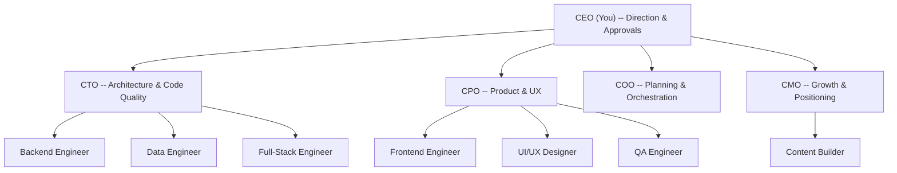

# gruAI Analysis: Autonomous AI Agent Team Framework

**Source**: https://github.com/andrew-yangy/gru-ai
**Analyzed**: 2026-03-20
**Status**: Alpha (98 stars, TypeScript, MIT license, created 2026-02-22)

---

## 1. Full README Content and Diagrams

### Tagline
> Stop coding with AI. Start running an AI team.

### The Core Premise
You issue directives as a CEO. 11 named agents (CTO, CPO, COO, CMO + 7 engineers) brainstorm, build, review, and ship autonomously through a 15-step pipeline. The human spends ~45 min/week reviewing reports and approving proposals.

### Organization Chart (Mermaid Diagram from README)



### Context Tree (State Architecture)

```
.context/
|-- vision.md                        # System vision
|-- directives/                      # ALL work lives here
|   |-- {id}/
|   |   |-- directive.json           # Pipeline state + progress
|   |   |-- directive.md             # CEO brief
|   |   |-- brainstorm.md            # Multi-agent deliberation
|   |   |-- audit.md                 # CTO findings
|   |   +-- projects/
|   |       +-- {project-id}/
|   |           +-- project.json     # Tasks, DOD, agents (THE source of truth)
|-- lessons/                         # Reactive learning (what went wrong)
|-- design/                          # Proactive knowledge (why things work this way)
|-- intel/                           # External research from /scout
+-- reports/                         # CEO dashboards
```

### Pipeline Walkthrough (from README)

The README includes a full narrative example: "/directive Create a landing page for gruAI":

1. **Triage** -- classified heavyweight (touches copy, layout, SEO, design)
2. **Audit** -- QA scans codebase, CTO recommends approach
3. **Debate** -- CTO, CPO, CMO independently propose approaches, then argue. Key quote: "You're not in the room." They find common ground.
4. **Clarify** -- You answer 3 questions (demo format, audience, URL path)
5. **Plan** -- COO breaks into 2 projects / 6 tasks, each with DOD
6. **Build** -- Engineers work on isolated branches with clean context windows
7. **Review** -- Up to 3 rounds with fresh-context evaluators. Example: CTO finds missing meta tag, WCAG contrast failure, layout break on iPhone SE
8. **Ship** -- Lessons captured, design docs updated, CEO digest generated
9. **Your Call** -- approve / amend / extend / redirect

### Weight Adaptation Table

| Weight | Example | Skips | You Decide At |
|--------|---------|-------|---------------|
| Lightweight | Fix a typo | Debate | Accept only |
| Medium | Add dark mode | Debate | Accept only |
| Heavyweight | New landing page | Nothing | Clarify + Plan + Accept |
| Strategic | Platform migration | Nothing | Clarify + Plan + Accept |

### Dashboard
There is a pixel-art office dashboard at localhost:4444 (React 19 + Vite + Canvas 2D). Agent characters physically move to meeting rooms during brainstorm/plan steps. Real-time pipeline progress via WebSocket from a file watcher on directive.json.

---

## 2. Architecture and Workflow

### 15-Step Pipeline (Full)

| # | Step | Purpose | Key Design Choice |
|---|------|---------|-------------------|
| 1 | Triage | Classify weight | Prevents heavyweight process for lightweight work |
| 2 | Checkpoint | Recover from prior crash | directive.json IS the checkpoint |
| 3 | Read | Load directive content | Context before any agent spawns |
| 4 | Context | Broader environment scan | Progressive disclosure |
| 5 | Audit | Codebase ground truth | Two-phase: QA investigates, CTO recommends |
| 6 | Brainstorm | Multi-perspective exploration | Heavyweight/strategic only, parallel independent critiques |
| 7 | Clarification | Synthesize verified intent | Runs for ALL weights, feeds COO a clean statement |
| 8 | Plan | COO decomposes into projects/tasks | AFTER audit so plan is grounded in codebase reality |
| 9 | Approve | CEO gate | Heavyweight/strategic only |
| 10 | Project-brainstorm | CTO + builder decompose tasks with DOD | AFTER approval so effort isn't wasted on rejected plans |
| 11 | Setup | Git worktree isolation | Keeps directive work separate |
| 12 | Execute | Build + review per task | Reviews inline, not batched |
| 13 | Review-gate | Hard verification gate | Bash scripts enforce -- no LLM judgment |
| 14 | Wrapup | Knowledge capture | Lessons, design docs, digest, stale doc detection |
| 15 | Completion | CEO approves | Never auto-completes |

### Agent Architecture

**Two tiers of agents:**

1. **C-Suite (Persistent Memory)**: CTO (Sarah), CPO (Marcus), COO (Morgan), CMO (Priya)
   - Each has a detailed personality file in `.claude/agents/{name}.md`
   - Institutional memory persists across directives via `.context/lessons/` and design docs
   - Each has an external intelligence domain (CTO: security/frameworks, CPO: competitors/market, CMO: SEO/growth, COO: agent frameworks/workflow tools)

2. **Engineers (Ephemeral, Per-Task)**: Backend, Frontend, Full-Stack, Data, UI/UX, QA, Content
   - Spawned as sub-agents with fresh context windows
   - Receive only their task scope + CEO brief + audit findings + DOD
   - Dissolved when task completes

**Agent Registry**: A single `agent-registry.json` maps role IDs to names, personality files, team membership, reporting hierarchy, and even pixel-art sprite configurations.

### MCP Server

The MCP server exposes 5 tools:
- `conductor_status` -- active directives, projects, tasks, completion counts
- `conductor_backlog` -- filtered backlog items from `.context/backlog.json`
- `conductor_add_backlog` -- add new backlog items with priority and triggers
- `conductor_launch_directive` -- preview + CLI command to execute a directive
- `conductor_report` -- read CEO reports

Built with `@modelcontextprotocol/sdk`, uses Zod schemas, runs on stdio.

### State and Recovery

**Core principle**: `directive.json` IS the checkpoint. No separate checkpoint files.

- Pipeline state persists in directive.json (step statuses, artifacts, current_step)
- Task state persists in project.json (task statuses, DOD verification)
- Any session can resume from these files without prior context
- Recovery: read directive.json -> find current_step -> resume from first incomplete step
- No re-execution of completed steps

### Validation Scripts (Bash, Not LLM)

| Script | What It Enforces |
|--------|-----------------|
| `validate-cast.sh` | Reviewer present, builder != reviewer, C-suite reviewer for complex work |
| `validate-project-json.sh` | Blocks execute if project.json missing/incomplete |
| `detect-stale-docs.sh` | Flags docs that reference modified files |
| `validate-gate.sh` | Validates prerequisites before advancing pipeline |
| `validate-reviews.sh` | Blocks completion without reviews, detects self-review |

---

## 3. Key Concepts

### A. Planning and Delegation

**The COO (Morgan) is the planning engine.** Her decision framework:

1. **Scope it** -- what exactly needs to happen, what does "done" look like
2. **Size it** -- solo work, pair work, or team work
3. **Cast it** -- who specifically should work on this (casting rules)
4. **Sequence it** -- ordering, parallelism identification
5. **Circuit-break it** -- signals that mean stop and re-evaluate

**Casting Rules** (effort scaling):
- **Solo** (cheapest): Routine implementation, simple bug fixes
- **Pair** (moderate): Architecture decisions get CTO review, user-facing features get CPO review
- **Full team** (expensive, high-stakes only): New product direction, major architecture changes, launches

**Challenge Mode**: The COO challenges every directive BEFORE planning. Identifies top 3 risks, flags over-engineering, recommends proceed or simplify. This is built into planning output, not a separate step.

**Hard rule**: No splitting, no follow-up directives. If the CEO says do X, Y, and Z -- plan all three. Never defer. Simplify the approach if scope is large, but deliver everything.

### B. Knowledge and Institutional Memory

**Three knowledge layers:**

1. **Lessons** (reactive -- what went wrong): Topic-based files in `.context/lessons/`. Auto-routed to relevant agents by role.
2. **Design docs** (proactive -- why the system works this way): In `.context/design/`. Captures principles, rationale, evidence, constraints.
3. **Learned Patterns** (agent-embedded): Extracted from lessons every 10th directive and injected into agent personality files.

**Knowledge routing by role:**
| Role | Reads |
|------|-------|
| All agents | `lessons/agent-behavior.md`, `design/context-flow.md`, `design/agent-model.md` |
| COO | `lessons/orchestration.md`, `design/pipeline-architecture.md` |
| CTO | `lessons/review-quality.md`, `design/verification.md` |
| Engineers | `lessons/skill-design.md`, `design/agent-model.md` |

**Critical insight from their lessons.md:**
> "With AI agents, do it all in one go. Deferred follow-ups get lost between sessions."

### C. Context Engineering (Their Core Differentiator)

**Progressive Disclosure**: Load context just-in-time, not all at once. The orchestrator reads one step doc at a time -- never all 15 simultaneously. Builders receive only their task scope.

**CEO Brief Flows Verbatim**: No intermediary rewrites the CEO's words. Intent degrades through abstraction layers. Builders and reviewers get the original text.

**Fresh Context Reviews**: Reviewers never see builder reasoning. They judge code on its own merits. This prevents confirmation bias.

**Context Budget Awareness**: The COO explicitly thinks about token cost. Quote from Morgan's personality: "Budget-conscious. You always ask: what's the cheapest way to get this done well?"

### D. Verification and Trust Boundaries

**Three verification layers:**
1. **Code Review** (mechanical) -- fresh-context review, NO builder reasoning
2. **Standard Review** (holistic) -- user perspective walkthrough + DOD verification
3. **UX Verification** (visual) -- orchestrator verifies via Chrome MCP

**Self-certification prevention:**
- Builder cannot mark own DOD as met (only reviewer updates DOD)
- Builder cannot review own code (bash script enforces)
- Agent cannot review changes to own personality file
- Review cannot be skipped (review-gate hard gate blocks)
- Zero-issue review flagged as suspicious

**Fix cycle bounds**: Code review max 3 rounds, standard review max 2 rounds. Remaining findings logged as warnings. Prevents infinite loops.

### E. Self-Evolution

**The COO (Morgan) monitors the external ecosystem** for agent framework developments and proposes system improvements. Quote from vision.md:

> "Morgan's ecosystem intelligence is how the system improves itself -- she researches external patterns and proposes conductor improvements."

**The Autonomous Loop:**
- Monday: `/scout` -- CEO reviews intelligence + approves proposals (~15 min)
- Tue-Thu: `/directive` executes approved work (autonomous)
- Friday: `/report` weekly -- CEO reviews dashboard (~20 min)
- Bi-weekly: `/healthcheck` -- auto-fix low-risk, batch medium-risk

**Success criterion**: 50%+ of initiatives should come from the team's external research, not CEO directives. Bottom-up proposals are the goal state.

---

## 4. What Makes This Approach Interesting or Different

### 4.1. Research-Grounded, Not Vibes-Based

Every design decision traces to published research with inline citations:
- Anthropic multi-agent research (Jun 2025): 90.2% improvement, token usage = 80% of variance
- Anthropic context engineering (Sep 2025): context rot begins at 8K-16K tokens
- Anthropic C compiler (Feb 2026): "task verifier must be nearly perfect"
- OpenAI harness engineering (Feb 2026): structural invariants > LLM judgment
- ArXiv codified context (Feb 2026): hot-memory + specialized agents + cold-memory

### 4.2. Harness > Model Intelligence

Their core thesis: **output quality is determined by the harness design, not model capability**. The 15-step pipeline, validation scripts, and review gates ARE the product. This inverts the common approach of "pick the best model and prompt it well."

### 4.3. Mechanical Verification Over LLM Judgment

Bash scripts enforce pipeline integrity. Self-review prevention, review-gate enforcement, schema validation, and step dependencies are all structural -- no LLM judges whether the pipeline was followed correctly.

### 4.4. Organizational Harness (Beyond Code Harness)

OpenAI's harness engineering describes the codebase layer. gruAI extends it with the organizational layer: domain ownership, challenge mode, bottom-up proposals, personality-driven decision-making, casting rules. The metaphor is a company, not a toolchain.

### 4.5. Context as Finite Degrading Resource

They treat context windows like a depletable resource under active degradation. Sub-agents get 2K tokens of focused context instead of 20K tokens of accumulated noise. Progressive disclosure loads one step doc at a time. CEO brief flows verbatim to prevent abstraction-layer degradation.

### 4.6. Institutional Memory That Compounds

Lessons, design docs, and standing corrections persist across directives. Every 10th directive, patterns are extracted from lessons and injected into agent personality files. The system literally gets better over time.

### 4.7. Weight-Adaptive Pipeline

Not one-size-fits-all. Lightweight directives skip debate and auto-approve. Strategic directives get two deliberation rounds. The triage step prevents token waste on simple tasks and safety gaps on complex ones.

---

## 5. Extractable Patterns for MCP-Based Planning and Delegation

### Pattern 1: Directive-as-Unit-of-Work

Instead of ad-hoc tool calls, wrap all work in a "directive" that flows through a defined pipeline. The directive has a lifecycle (triage -> plan -> execute -> review -> ship) with persistent state in a JSON file.

**Applicable to CrowdListen**: Wrap analysis requests in a directive pattern. Each analysis request gets triaged, planned (which skills/tools to use), executed, reviewed (quality check on results), and reported.

### Pattern 2: Casting Rules for Tool/Agent Selection

Formalize rules for which tools or agents handle which tasks. The COO doesn't decide on the fly -- there are explicit casting rules based on task complexity and domain.

**Applicable to CrowdListen**: Define casting rules for CrowdListen tools. Simple sentiment query = single tool. Cross-platform synthesis = multiple tools with review. Competitive analysis = full pipeline with multiple data sources.

### Pattern 3: State-as-Files, Not Memory

All state in version-controlled JSON/markdown files. Any session can resume from files alone. No session memory dependence.

**Applicable to CrowdListen**: Analysis state in `.context/analyses/` with JSON tracking. Resume interrupted analyses. Build institutional memory of past analyses for better future ones.

### Pattern 4: Separation of Investigation and Recommendation

Their two-phase audit (QA investigates data, CTO recommends approach) prevents confirmation bias. The data gatherer doesn't propose solutions.

**Applicable to CrowdListen**: Separate data collection (Crowdlisten search/analysis) from insight synthesis. One pass gathers data, a second pass interprets it.

### Pattern 5: Fresh-Context Review

Reviewers never see builder reasoning. They evaluate output on its own merits.

**Applicable to CrowdListen**: Quality check on analysis results using a separate context that doesn't know how the data was gathered. Catches hallucinated insights.

### Pattern 6: Mechanical Validation Gates

Bash scripts, not LLM judgment, enforce pipeline integrity. Schema validation, completeness checks, dependency verification.

**Applicable to CrowdListen**: Validate analysis outputs mechanically. Check that sources are cited, confidence levels are assigned, contradictions are flagged. Don't let the LLM judge its own work quality.

### Pattern 7: Progressive Context Disclosure

Load context just-in-time. Don't dump everything into a single prompt.

**Applicable to CrowdListen**: For multi-step research, load only the current step's context. Pass condensed summaries between steps, not raw data. Keep each agent call focused.

### Pattern 8: Institutional Memory with Role-Based Routing

Lessons are stored by topic and routed to agents by role. Not everyone reads everything.

**Applicable to CrowdListen**: Store research patterns and successful query formulations. Route them to relevant skills. The product-signals skill gets product-related patterns; the competitive-intel skill gets competitor-related patterns.

### Pattern 9: Challenge Before Execute

The COO challenges every directive before planning. Identifies risks, flags over-engineering, recommends simplification.

**Applicable to CrowdListen**: Before running an expensive multi-platform analysis, challenge the request. Is this the right scope? Could a simpler analysis deliver 80% of the value? What are the risks (API limits, data quality)?

### Pattern 10: Agent Personality as Behavioral Contract

Agent personality files are not flavor text. They are behavioral contracts that constrain what an agent does and does not do. Quote: "You don't write code. You orchestrate." These constraints prevent scope creep and role confusion.

**Applicable to CrowdListen**: Define skill personalities with explicit boundaries. The product-signals skill analyzes product feedback, NOT competitive positioning. The competitive-intel skill tracks competitors, NOT content strategy. Clear "What You Don't Do" sections prevent skills from overlapping or hallucinating beyond scope.

---

## 6. Research References (from the README)

- [Building Effective Agents](https://www.anthropic.com/research/building-effective-agents) (Anthropic, Dec 2024)
- [Effective Context Engineering](https://www.anthropic.com/engineering/effective-context-engineering-for-ai-agents) (Anthropic, Sep 2025)
- [Multi-Agent Research System](https://www.anthropic.com/engineering/multi-agent-research-system) (Anthropic, Jun 2025)
- [Building a C Compiler](https://www.anthropic.com/engineering/building-c-compiler) (Anthropic, Feb 2026)
- [Harness Engineering](https://openai.com/index/harness-engineering/) (OpenAI, Feb 2026)
- [Codified Context](https://arxiv.org/abs/2602.20478) (ArXiv, Feb 2026)
